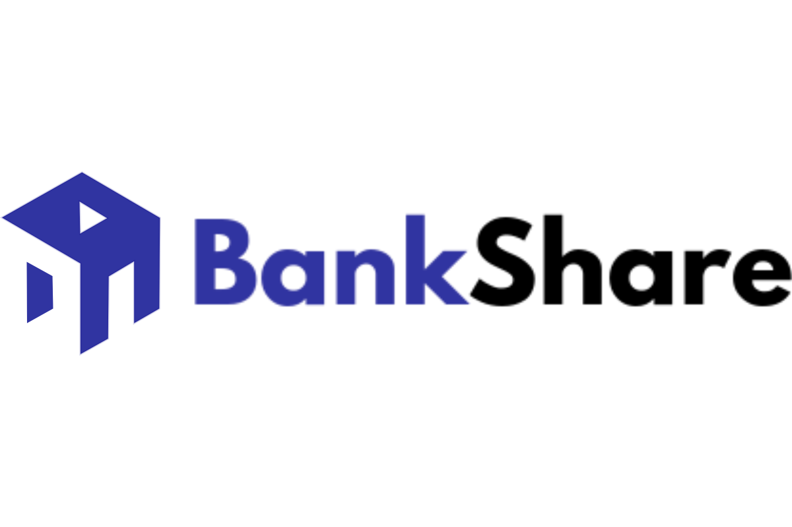

 

BankShare
---

Simple, trustless banking and key management backed by Crypto and blockchain, without the mess of managing private and public keys. Venmo for crypto with just an email address.

## Context
About 1.7 billion adults remain unbanked - without an account at a financial institution or through a mobile money provider. Many well known exchanges allow you to hold and trade funds, but require identity verification, proof of address, social security, etc. just to sign up.

BankShare is a private wealth storage platform enabling frictionless account sign up and transactions for everyone. By using the Taxa network, we are able to anonymously set up lending offers without disclosing the depth or number of offers in the network and let the server do the matching.

### Services
* Torus: login and payment tracking
* Taxa: Anonymous pairing and loan offerings
* Squarelink currency exchange